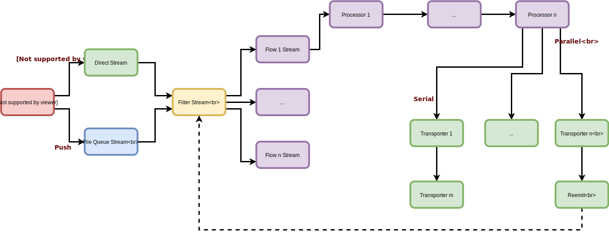

# Conceptos básicos

## Qué es nsyslog
nsyslog is, en esencia, un agente de logs: Esto es, un proceso que lee fuentes de logs, los parsea, transforma, procesa y reenvía a diferentes destinos.

Aunque esa es su principal función, la arquitectura de nsyslog permite que éste sea usado para un amplio espectro de casos de uso.

## ¿Qué se puede hacer?
Algunos ejemplos:

* Levantar un servidor de Syslog que escuche bajo UCP y/o TCP, filtrar y clasificar los mensajes recibidos, y almacenarlos en disco.
* Leer logs de un servidor HTTP (Apache, tomcat, nginx), parsear las líneas, geoposicionar IPs, agregar datos de usuario, etc... y almacenar los datos estructurados en una base de datos.
* Suscribirse a una cola de mensajes (Kafka, redis, zmq...), recolectar eventos de seguridad y ejecutar reglas de correlación. Publicar nuevas alertas a un servicio REST.
* Leer eventos de Windows y enviarlos a un SIEM (ArchSight, Splunk)

There's many more that can be done; it depends on your use case. To achieve this level of functionality, NSyslog core architecture is described as follows

## Architecture

There are four basic components that run under NSyslog:

* **inputs**: Inputs are responsible for collecting data. An input can be a file reader, an HTTP server, Syslog server, database connector, etc... Inputs collect data one **entry** (line) at a time, and can be active (pull) or passive (push)
* **processors**: Processors are cappable of operate over each entry, to perform operations and transformations. They can parse raw data, json, csv or syslog data, stablish new and computed properties, filter and group, etc... Some processors can even be multithreaded (Yes, in node!).
* **transporters**: They are the opposite of inputs; They receive the processed entries and send them to their destination endpoints.
* **flows**: A flow describes a path between inputs, processors and transporters, and are responsible of manage all the process as fast as possible, guaranteeing message order and fault tolerance. Additionally, flows can be forked to take advantage of multi-core cpus.

When inputs collect data, it can be done via *pull* or *push* methods. *Pull* inputs are those that read entries whenever the flows requires it. For example, file inputs are *pull inputs*, since they *activelly* read the file contents only when requested. As opposite, *push* inputs listens for incoming data, and push it to the flow as soon as it arrives, so they cannot perform any flow control. For example, an HTTP server listens for connections and receive the data. In these cases, data is buffered in disk, so the flows are not overflowed by the incoming entries.

When a entry matches a flow condition (that is, a flow wants to process this kind of data), it sends the entries to the processors, that can be either sync, or async. The flow process guarantees that the entry order is preserved.

Finally, when the entries arrive to the transporters phase, they are sent to its final destinations. The flow can configure transporters to operate in serial or parallel mode (or a mix, as we will see)

[Back](../README.md)
